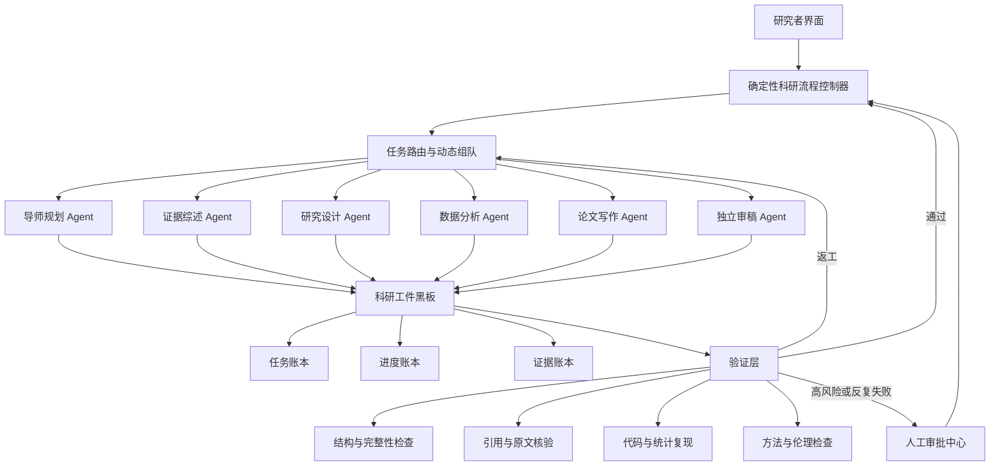
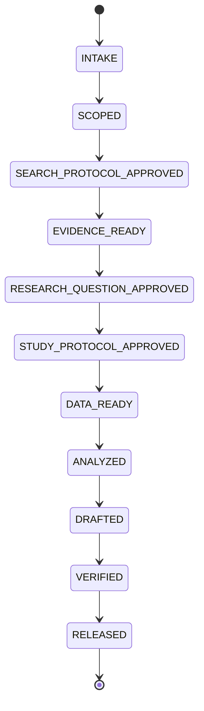

# STEM-SCI 助研项目全流程规划

> 项目定位：面向 STEM 教育研究的可追溯科研协作系统  
> 规划日期：2026 年 7 月 22 日  
> 比赛截止：2026 年 9 月 15 日  
> 核心原则：流程控制优先、真实数据优先、证据追溯优先、关键科研决策由人确认。

---

## 1. 项目最终要交付什么

项目最终不是一个“能和六个 Agent 聊天的网页”，而是一套能够真实跑通以下闭环的科研协作系统：

```text
创建研究项目
→ 明确研究范围
→ 制定检索协议
→ 检索、筛选和抽取真实论文
→ 建立证据矩阵并发现研究空白
→ 确定研究问题
→ 设计研究方案和分析计划
→ 导入、审计和冻结真实数据
→ 执行可复现分析
→ 生成主张—证据映射
→ 分章节写作
→ 独立审稿与质量核验
→ 导出论文、PPT、复现包和审计报告
```

### 最终产品成果

1. 一套可运行的 STEM-SCI 助研系统；
2. 一条文献综述与研究空白发现闭环；
3. 一条研究设计闭环；
4. 一条真实数据分析与论文写作闭环；
5. 六类按需调用的科研 Agent；
6. 完整的证据、数据、版本和审批记录；
7. 三个代表性演示案例；
8. 真实用户测试和效果对照；
9. 比赛 PPT、三分钟演示视频、代码和说明材料。

---

# 2. 项目总体架构



系统由四个平面组成：

| 平面 | 作用 | 核心内容 |
|---|---|---|
| 控制平面 | 决定项目怎么推进 | 状态机、路由、预算、重试、审批 |
| 执行平面 | 执行专业科研任务 | 六类专业 Agent、检索和分析工具 |
| 工件平面 | 保存真实科研成果 | 论文卡片、证据矩阵、方案、代码、论文 |
| 验证平面 | 防止错误向后传播 | 格式、引用、数据、代码、方法和人工核验 |

---

# 3. 用户完整科研流程

## 阶段 0：创建项目

### 用户操作

- 选择 STEM 教育研究模板；
- 填写研究主题、对象、场景和目标成果；
- 上传已有论文、方案或数据；
- 填写时间、期刊、比赛和伦理限制。

### 系统功能

- 项目创建向导；
- 场景模板；
- 文件上传与类型识别；
- 数据和隐私风险提示；
- 项目目录及初始状态创建。

### Agent

导师规划 Agent。

### 输出工件

- `ProjectProfile`
- `ResearchContract`

### 通过条件

- 研究对象明确；
- 研究范围明确；
- 成果类型明确；
- 数据和伦理边界明确；
- 用户确认研究契约。

---

## 阶段 1：研究范围和初步问题

### 系统功能

- 研究问题树；
- 核心概念图；
- 理论框架候选；
- 问题可行性检查；
- 研究范围过宽、过窄或不可测量提示。

### Agent

导师规划 Agent，必要时调用证据综述 Agent进行小规模探索检索。

### 输出工件

- `ResearchQuestionTree`
- `ConceptMap`
- `PreliminaryTheoryFramework`

### 通过条件

- 已形成可检索的初步问题；
- 概念定义不存在明显歧义；
- 没有把预期结论写进研究问题。

---

## 阶段 2：检索协议设计

### 系统功能

- 数据库选择；
- 中英文关键词扩展；
- 布尔检索式生成；
- 数据库检索式转换；
- 时间、语言、文献类型限制；
- 纳入和排除标准编辑；
- 检索协议版本管理。

### Agent

证据综述 Agent。

### 输出工件

- `SearchProtocol`
- `EligibilityCriteria`
- `SearchQuerySet`

### 人工闸门 G1

研究者确认：

- 数据库；
- 检索式；
- 纳排标准；
- 时间范围；
- 筛选策略。

未经确认，不允许执行正式检索。

---

## 阶段 3：论文检索和导入

### 系统功能

- 数据库/API检索；
- DOI导入；
- RIS、BibTeX、CSV导入；
- PDF批量上传；
- 元数据解析；
- DOI、标题和作者联合去重；
- 合并记录而非直接删除；
- 检索批次和日期记录。

### Agent协作

- 可按数据库启动多个同类检索 Worker；
- 中央控制器合并结果；
- 证据综述 Agent检查检索覆盖和重复项。

### 输出工件

- `LiteratureLibrary`
- `SearchRunLog`
- `DeduplicationLog`

### 通过条件

- 每篇论文有稳定编号；
- 元数据来源可追溯；
- 重复项有合并记录；
- 检索数量可以进入 PRISMA 统计。

---

## 阶段 4：标题、摘要与全文筛选

### 系统功能

- 逐条显示纳排标准；
- `INCLUDE / EXCLUDE / UNCERTAIN` 三值判断；
- 排除原因标准化；
- 低置信度和冲突项进入人工队列；
- 全文缺失提示；
- 双重核验；
- PRISMA数量自动更新。

### Agent协作

- 多个筛选 Worker并行；
- Reviewer或第二模型仅复核不确定项、高影响论文和最终纳入论文；
- 人工裁决冲突项。

### 输出工件

- `ScreeningDecisionTable`
- `ExclusionReasonTable`
- `PRISMALedger`

### 人工闸门 G2

确认最终纳入论文集合。

---

## 阶段 5：论文全文解析和结构化抽取

### 系统功能

- PDF/XML全文解析；
- OCR失败提示；
- 表格识别；
- 研究对象、样本、设计、干预、变量和结果抽取；
- 页码、章节和原文片段定位；
- 数字字段重点核验；
- 抽取字段导出为表格。

### 每篇论文的核心字段

- 研究目的；
- 国家和教育阶段；
- STEM学科；
- 样本量；
- 研究设计；
- 干预与对照；
- 干预时间；
- 理论框架；
- 自变量和因变量；
- 测量工具；
- 分析方法；
- 主要结果和效应值；
- 局限；
- 与当前研究问题的关系。

### 输出工件

- `PaperCard`
- `ExtractionTable`
- `SourceSpan`

### 通过条件

- 所有关键字段均有来源位置或明确标记“原文未报告”；
- 数字不能只由模型记忆生成；
- 不允许用摘要推断全文未报告的结果。

---

## 阶段 6：证据综合、冲突分析和研究空白

### 系统功能

- 主题聚类；
- 主张—证据矩阵；
- 支持和反向证据并列展示；
- 研究质量和适用场景记录；
- 冲突原因比较；
- 研究空白分类；
- 证据强度状态。

### 证据状态

```text
SUPPORTED    证据较充分
TENTATIVE    有限支持
CONFLICTED   证据冲突
UNSUPPORTED  没有足够证据
```

### Agent协作

- 证据综述 Agent生成综合；
- 冲突较大时启动支持方、反方和方法比较三方分析；
- 定向辩论最多两轮；
- 不强制消除真实分歧。

### 输出工件

- `EvidenceMatrix`
- `ContradictionMap`
- `ResearchGapReport`
- `CandidateResearchQuestions`

### 人工闸门 G3

研究者选择并确认最终研究问题。

---

## 阶段 7：研究方案设计

### 系统功能

- DBR模板；
- 准实验模板；
- 混合研究模板；
- 研究假设；
- 样本与分组；
- 干预和对照流程；
- 变量操作化；
- 测量工具及来源；
- 数据收集时间点；
- 统计和质性分析计划；
- 伦理、隐私和知情同意检查；
- 替代解释和失败风险。

### Agent协作

- 研究设计 Agent生成主体方案；
- 证据综述 Agent核对测量工具和理论依据；
- 数据分析 Agent检查分析计划是否可执行；
- Reviewer检查问题—设计—数据—分析是否一致。

### 输出工件

- `StudyProtocol`
- `VariableDictionary`
- `InstrumentPlan`
- `SamplingPlan`
- `AnalysisPlan`
- `EthicsChecklist`

### 人工闸门 G4

研究者批准研究设计、伦理边界和分析计划，批准版本随后锁定。

---

## 阶段 8：数据导入、脱敏、审计与冻结

### 系统功能

- CSV/Excel导入；
- 问卷和前后测数据映射；
- 字段类型识别；
- 数据字典；
- 隐私字段检测；
- 缺失值、重复项、异常范围和错误编码检查；
- 样本量、分组和时间点核对；
- 清洗方案确认；
- 原始、脱敏和清洗数据分层保存；
- 数据哈希与版本冻结。

### 输出工件

- `DataDictionary`
- `DataAuditReport`
- `CleaningPlan`
- `FrozenDataset`

### 人工闸门 G5

研究者确认：

- 数据来源合法；
- 数据已经脱敏；
- 字段解释正确；
- 清洗规则合理；
- 正式分析使用的数据版本正确。

---

## 阶段 9：可复现数据分析

### 系统功能

- 依据已批准计划选择分析方法；
- 分析假设检查；
- 代码生成与受控执行；
- 描述统计；
- 信度分析；
- 前测等价性；
- 常用组间和前后测分析；
- 效应量；
- 稳健性检查；
- 表格和图形；
- 环境、参数、随机种子和日志记录；
- 一键复现。

### 分层职责

| 层 | 职责 |
|---|---|
| 确定性执行层 | 严格按分析计划运行并保存真实输出 |
| 数据分析 Agent | 解释结果、检查局限、提出替代解释 |
| Reviewer | 检查方法、数值、结论和复现结果 |

### 输出工件

- `AnalysisCode`
- `RunManifest`
- `StatisticalResults`
- `ResultsTables`
- `ResultsFigures`
- `RobustnessChecks`
- `ReproducibilityBundle`

### 通过条件

- 代码可重新执行；
- 多次运行结果一致；
- 计划外分析标记为探索性；
- 不显著结果没有被删除；
- 正文、表格和图形数值一致。

---

## 阶段 10：主张—证据映射与论文写作

### 写作顺序

```text
Results
→ Methods
→ Discussion
→ Introduction
→ Abstract
→ Title与Keywords
```

### 系统功能

- 章节化写作；
- 主张—证据映射；
- 引用插入；
- DOI和元数据核验；
- 引用是否支持句子的检查；
- 图表与正文数值联动；
- 修改历史；
- 目标期刊格式；
- 摘要、PPT大纲和演示脚本生成。

### 内容来源标签

```text
LITERATURE_FACT   文献事实
STUDY_RESULT      本研究结果
AUTHOR_INTERPRET  作者解释
SPECULATION       推测或未来研究建议
```

### 输出工件

- `ClaimEvidenceMap`
- `ManuscriptDraft`
- `ReferenceList`
- `Abstract`
- `PPTOutline`
- `DemoNarrative`

---

## 阶段 11：独立审稿、修订和发布

### 审稿功能

- 问题是否清晰；
- 文献是否完整；
- 引用是否支持主张；
- 方法是否回答问题；
- 分析是否正确；
- 是否把相关写成因果；
- 是否遗漏反向或不显著证据；
- 是否过度推广；
- 论文、PPT和演示数字是否一致；
- 是否存在隐私和伦理风险。

### 修订循环

```text
Reviewer定位问题
→ 控制器指定责任Agent
→ 修改对应工件
→ 自动重新核验
→ Reviewer复审
→ 最多三轮
→ 仍有争议则交给研究者
```

### 输出工件

- `ReviewReport`
- `RevisionLog`
- `ReleaseChecklist`
- `AuditReport`
- 最终论文、PPT、演示和复现包。

### 人工闸门 G6

研究者完成最终发布确认。

---

# 4. 项目状态机与任务状态

## 4.1 项目主状态



只有流程控制器可以改变项目主状态。

## 4.2 单任务状态

```text
DRAFT
→ READY
→ RUNNING
→ REVIEW
→ APPROVED
→ DONE
```

异常状态：

| 状态 | 含义 |
|---|---|
| REWORK | 质量闸门不通过，需要返工 |
| FAILED | 工具、代码或模型执行失败 |
| BLOCKED | 缺少数据、全文、权限或伦理条件 |
| WAITING_HUMAN | 必须等待研究者做决定 |
| CANCELLED | 用户主动取消该任务 |

---

# 5. Agent协作流程

## 5.1 Agent任务信封

所有 Agent任务统一包含：

```text
task_id
project_id
责任Agent
任务目标
输入工件ID
允许使用的工具
禁止操作
预期输出结构
验收标准
时间与费用预算
终止条件
失败处理方式
```

## 5.2 动态组队规则

| 任务特征 | 架构选择 |
|---|---|
| 严格顺序、连续推理 | 单 Agent |
| 可拆分的批量检索和抽取 | 同类 Worker并行 |
| 多路结果需要合并 | 中央控制器汇总 |
| 存在重要证据冲突 | 限定角色的两轮辩论 |
| 方法、伦理和最终结论 | Agent建议 + 人工决策 |

## 5.3 Agent权限

| Agent | 可以做 | 不可以做 |
|---|---|---|
| 导师规划 | 规划、拆题、理论框架 | 编造文献和结果 |
| 证据综述 | 检索、筛选、抽取、综合 | 修改真实数据 |
| 研究设计 | 方案、变量、测量、伦理 | 宣布实验结果 |
| 数据分析 | 审计、代码、分析、解释 | 覆盖原始数据 |
| 论文写作 | 组织已核验内容 | 创造新证据和数值 |
| 独立审稿 | 只读检查、退回问题 | 直接修改结果 |

---

# 6. 质量闸门

| 闸门 | 检查内容 | 通过后进入 |
|---|---|---|
| G0 范围闸门 | 对象、场景、成果、边界 | 检索设计 |
| G1 检索闸门 | 数据库、检索式、纳排标准 | 正式检索 |
| G2 文献闸门 | 去重、筛选、来源、全文 | 证据综合 |
| G3 证据闸门 | 主张、支持/反向证据、空白 | 研究问题确认 |
| G4 方法闸门 | 设计、变量、伦理、分析计划 | 数据收集/导入 |
| G5 数据闸门 | 来源、脱敏、质量、冻结版本 | 正式分析 |
| G6 分析闸门 | 代码、假设、复现、数值 | 论文写作 |
| G7 写作闸门 | 主张—证据、引用、数字 | 独立审稿 |
| G8 发布闸门 | 全部材料一致、人工确认 | 正式交付 |

---

# 7. 异常、停滞和回滚流程

## 7.1 停滞触发条件

- 相同工具和参数重复两次；
- 连续三步没有新增有效证据或工件；
- 连续两次返工后质量没有提升；
- Agent关键结论持续冲突；
- 缺少真实论文全文、数据或伦理条件；
- 超过任务时间、调用次数或费用预算；
- Reviewer连续两次指出同类错误。

## 7.2 恢复规则

```text
第一次失败
→ 原Agent根据明确错误修复

第二次失败
→ 控制器重新拆解任务、更换工具或改变协作方式

第三次失败
→ 停止自动执行，进入WAITING_HUMAN

缺少证据、数据或伦理条件
→ 直接BLOCKED，禁止生成模拟结果冒充真实结果
```

## 7.3 回滚对象

- 检索协议版本；
- 筛选决定；
- 抽取字段；
- 研究方案；
- 数据清洗版本；
- 分析代码和运行；
- 论文章节。

任何回滚都保留原版本和回滚原因。

---

# 8. 产品页面规划

第一版建议设计七个主页面。

## 8.1 项目总览

- 阶段时间线；
- 当前状态；
- 下一步任务；
- 待审批事项；
- 风险与阻塞；
- 已核验比例；
- Agent活动；
- 时间和费用。

## 8.2 研究规划台

- 研究契约；
- 研究问题树；
- 概念图；
- 理论框架；
- 项目路线图。

## 8.3 文献与证据中心

- 检索协议；
- 文献库；
- 三值筛选；
- PDF原文；
- PaperCard；
- 证据矩阵；
- 冲突图；
- PRISMA图；
- 研究空白。

## 8.4 研究设计台

- 设计模板；
- 样本与分组；
- 干预流程；
- 变量字典；
- 测量工具；
- 伦理检查；
- 分析计划。

## 8.5 数据实验室

- 数据上传；
- 数据字典；
- 质量检查；
- 清洗规则；
- 分析代码；
- 运行日志；
- 表格和图形；
- 一键复现。

## 8.6 论文工作台

- 论文目录；
- 分章节写作；
- 主张—证据映射；
- 引用管理；
- Reviewer意见；
- 版本比较；
- PPT与汇报生成。

## 8.7 审批与审计中心

- 待人工确认；
- 质量闸门结果；
- 返工和失败记录；
- 来源核验状态；
- 数据和代码版本；
- 最终发布清单。

---

# 9. 功能优先级

## P0：必须实现

- 项目创建；
- 状态机；
- 科研工件和版本；
- 人工审批；
- 真实文献导入；
- 去重和三值筛选；
- PaperCard与原文定位；
- 证据矩阵；
- 研究设计模板；
- CSV/Excel导入；
- 数据审计；
- 至少一条真实统计分析；
- 主张—证据写作；
- 独立审稿；
- 运行日志和来源标签。

## P1：比赛效果增强

- 多数据库真实检索；
- 并行检索和抽取 Worker；
- PRISMA图自动生成；
- 引用支持检查；
- 冲突证据分析；
- DBR迭代模板；
- 多种常用统计方法；
- 一键复现；
- PPT和演示脚本生成；
- 架构对照实验面板。

## P2：赛后扩展

- 音视频和课堂多模态分析；
- 自动量表识别；
- 更多学科包；
- 期刊投稿和审稿回复；
- 团队协作和权限；
- 私有化知识库；
- 模型微调；
- 商业化计费和组织管理。

---

# 10. 研发实施流程

## 10.1 研发主线


## 10.2 每个功能的统一开发流程

```text
定义用户故事
→ 定义输入和输出工件
→ 定义状态与权限
→ 定义Agent和工具
→ 定义质量闸门
→ 实现
→ 单元测试
→ 真实案例测试
→ 失败注入测试
→ 用户验收
→ 合并到主流程
```

## 10.3 完成定义 Definition of Done

一个功能只有满足以下条件才算完成：

- 使用真实输入运行成功；
- 输出已保存为正式工件；
- 来源和版本可追溯；
- 失败时有明确提示；
- 能从中断位置恢复；
- 有自动或人工验收标准；
- 不依赖未标记的模拟数据；
- 已通过至少一个代表性案例。

---

# 11. 倒排时间计划

## 第一阶段：范围冻结与流程骨架

### 7月22日—7月27日

目标：确定只做什么，并搭好项目主骨架。

任务：

- 冻结主场景：AI支持STEM探究式学习研究；
- 确定三个代表性案例；
- 完成数据和工件模型；
- 完成项目状态机；
- 完成任务、审批、来源状态和日志；
- 清理模拟数据与真实结果的混淆。

里程碑 M1：

> 用户可以创建项目、确认研究契约、查看阶段流程，并对工件进行批准或退回。

## 第二阶段：真实文献闭环

### 7月28日—8月8日

任务：

- 文献导入和真实检索；
- PDF/元数据解析；
- 去重；
- 三值筛选；
- 排除原因；
- PaperCard；
- 原文定位；
- 证据矩阵；
- PRISMA记录；
- 研究空白和候选问题。

里程碑 M2：

> 30—100篇真实论文能够形成完整筛选记录、证据矩阵和候选研究问题。

## 第三阶段：研究设计闭环

### 8月9日—8月16日

任务：

- DBR和准实验模板；
- 变量字典；
- 干预和对照流程；
- 测量工具及来源；
- 伦理检查；
- 分析计划；
- 方法审稿和人工批准。

里程碑 M3：

> 用户选择研究问题后，可以生成并批准一份可执行的完整研究方案。

## 第四阶段：真实数据分析闭环

### 8月17日—8月26日

优先案例：实验组与对照组的前测—后测数据。

任务：

- CSV/Excel导入；
- 数据字典；
- 脱敏和数据审计；
- 数据冻结；
- 描述统计；
- 前测检查；
- 组间/前后测分析；
- 效应量；
- 图表；
- 运行清单；
- 一键复现。

里程碑 M4：

> 同一份真实脱敏数据可以稳定复现相同统计结果，图表和正文数值一致。

## 第五阶段：写作、审稿与最终产品闭环

### 8月27日—9月3日

任务：

- 主张—证据映射；
- 分章节写作；
- 引用核验；
- Reviewer退回和修订；
- 论文、摘要、PPT大纲和演示脚本；
- 最终审计报告。

里程碑 M5：

> 从真实文献和数据出发，能够生成可核验的论文核心章节，并完成独立审稿闭环。

## 第六阶段：评测和真实用户测试

### 9月4日—9月8日

任务：

- 单 Agent与动态多 Agent对照；
- 有无证据核验对照；
- 异常和失败注入；
- 两名以上真实目标用户测试；
- 汇总准确率、时间、成本和满意度；
- 修复高频问题。

里程碑 M6：

> 形成可放入比赛PPT的定量效果数据和真实用户反馈。

## 第七阶段：比赛材料制作

### 9月9日—9月13日

任务：

- 完善比赛PPT；
- 录制三分钟交互视频；
- 准备三个代表性案例；
- 整理代码、部署说明和模型信息；
- 检查AI生成内容标识；
- 准备常见答辩问题。

里程碑 M7：

> 比赛全部材料形成可提交版本。

## 第八阶段：缓冲与提交

### 9月14日—9月15日

- 全量回归测试；
- 检查文件大小和视频时长；
- 检查链接、账号和部署；
- 备份代码和材料；
- 正式提交。

---

# 12. 三个代表性案例

## 案例一：系统综述与研究空白

用户目标：研究AI支持STEM探究式学习的已有证据。

展示功能：

- 检索协议；
- 文献导入；
- 三值筛选；
- PRISMA；
- PaperCard；
- 原文定位；
- 证据矩阵；
- 冲突证据；
- 候选研究问题。

## 案例二：准实验或DBR研究设计

用户目标：设计AI反馈支持高中科学探究的课堂研究。

展示功能：

- 理论框架；
- 研究假设；
- 干预和对照；
- 变量和测量；
- 数据收集；
- 伦理；
- 分析计划；
- 方法审稿。

## 案例三：真实数据分析与论文写作

用户目标：分析脱敏的前后测数据并形成论文结果和讨论。

展示功能：

- 数据审计；
- 版本冻结；
- 可复现代码；
- 统计结果和图表；
- 主张—证据映射；
- Results和Discussion；
- 独立审稿；
- 一键导出。

---

# 13. 测试与评测流程

## 13.1 功能测试

- 项目状态是否正确推进；
- 权限是否越界；
- 工件版本是否完整；
- 审批和退回是否生效；
- 中断后能否恢复；
- 导入导出是否正确。

## 13.2 科研质量测试

- 文献召回率；
- 筛选准确率；
- 原文定位率；
- 抽取准确率；
- 引用支持率；
- 方法匹配度；
- 统计复现率；
- 主张—证据覆盖率；
- 论文与图表数字一致率。

## 13.3 失败注入测试

- 删除一篇关键论文；
- 提供互相冲突的论文；
- 上传损坏PDF；
- 上传包含错误编码和缺失值的CSV；
- 让检索或模型调用失败；
- 中途终止后恢复；
- 提供无法由现有数据回答的问题；
- 让Reviewer指出同类错误多次。

观察系统是否能够：

- 发现问题；
- 明确报告；
- 停止错误传播；
- 回滚或重新规划；
- 请求人工处理。

## 13.4 架构消融实验

比较：

1. 单 Agent；
2. 固定六 Agent；
3. 动态多 Agent；
4. 动态多 Agent但没有证据核验；
5. 动态多 Agent但没有人工闸门。

测量：

- 任务成功率；
- 准确率；
- 错误传播；
- 耗时；
- 模型成本；
- 人工修改次数；
- 用户满意度。

---

# 14. 团队分工流程

在尚未确定具体成员姓名前，建议按角色分工。

| 角色 | 主要责任 |
|---|---|
| 产品/科研负责人 | 冻结场景、用户流程、研究规范和验收标准 |
| 架构负责人 | 状态机、任务调度、工件、日志和权限 |
| 文献能力负责人 | 检索、解析、筛选、抽取、证据和PRISMA |
| 数据分析负责人 | 数据审计、统计执行、复现和图表 |
| 前端负责人 | 七个主页面、流程可视化和交互 |
| 测试与评测负责人 | 案例、标注、质量指标、消融和用户测试 |
| 材料负责人 | PPT、视频、文档、答辩和提交检查 |

每周至少进行两次固定同步：

- 周初：确认里程碑、依赖和责任人；
- 周末：用真实案例演示，不用口头汇报代替运行结果。

---

# 15. 数据与内容治理流程

## 来源状态

```text
demo_seed                   演示种子数据
model_generated_unverified  模型生成、未经核验
source_verified             已与原论文或数据源核对
human_verified              已由研究者人工确认
```

只有 `source_verified` 和 `human_verified` 可以进入正式结论。

## 数据规则

- 原始数据只读；
- 脱敏后才能进入模型；
- 清洗操作有日志；
- 正式分析数据必须冻结；
- 所有运行关联数据哈希；
- 不上传无授权的个人敏感信息；
- 演示案例优先使用脱敏或公开数据。

## AI内容规则

- 模型生成内容必须可识别；
- 不伪造论文、DOI、样本和结果；
- 没有证据时允许返回“不足以判断”；
- 人工修改和AI修改分别记录；
- 对外材料按比赛要求标注AI生成内容。

---

# 16. 比赛交付流程

## 需要准备的材料

- 可运行系统或服务ID；
- 项目源代码；
- 产品和技术说明；
- 比赛PPT，控制文件大小；
- 不超过三分钟的交互演示视频；
- 三个代表性案例；
- 两名以上真实目标用户反馈；
- 效果验证和对照数据；
- AI生成内容标识；
- 部署和使用说明。

## 三分钟视频建议流程

```text
0:00—0:20 真实科研痛点与项目定位
0:20—0:50 创建项目和研究契约
0:50—1:30 文献筛选、原文定位和证据矩阵
1:30—2:00 研究方案与人工审批
2:00—2:30 数据分析、图表和一键复现
2:30—2:50 主张—证据写作与独立审稿
2:50—3:00 效果数据和项目价值
```

---

# 17. 当前立即执行的任务清单

## 今天必须决定

- [ ] 正式冻结主场景；
- [ ] 确认三个代表性案例；
- [ ] 确认第一条闭环从文献综述开始；
- [ ] 确认前后测数据案例；
- [ ] 确认两位真实用户来源；
- [ ] 为各模块指定责任人。

## 本周必须完成

- [ ] 项目状态机；
- [ ] 工件数据模型；
- [ ] 三本账本；
- [ ] 人工审批流程；
- [ ] 来源状态标签；
- [ ] 模拟与真实数据隔离；
- [ ] 真实文献导入最小链路；
- [ ] 第一套真实论文测试集。

## 不应优先投入的事项

- 暂不增加更多 Agent角色；
- 暂不开发复杂社交式 Agent对话；
- 暂不做大规模模型微调；
- 暂不做原始课堂音视频分析；
- 暂不同时扩展SCI和SSCI多个学科包；
- 暂不追求覆盖所有统计方法；
- 暂不先制作大量动画和视觉包装。

---

# 18. 项目成功标准

比赛前满足以下条件，项目才算真正完成：

- [ ] 至少一条端到端科研流程真实跑通；
- [ ] 三个案例都使用真实论文或真实脱敏数据；
- [ ] 每个重要结论可以定位到证据或分析结果；
- [ ] 研究方案有人工审批；
- [ ] 数据分析能够复现；
- [ ] 论文、PPT和视频中的数字一致；
- [ ] 系统能够发现并处理失败；
- [ ] 至少两位真实用户完成任务；
- [ ] 有单 Agent与动态多 Agent对照数据；
- [ ] 所有演示种子和模型生成内容清楚标记；
- [ ] 比赛材料在9月13日前形成最终候选版本；
- [ ] 9月15日前完成正式提交。

---

## 一句话总结

> 整个项目的推进顺序应当是：先冻结一个真实科研场景，再搭建可控制、可回滚的流程骨架；随后依次跑通真实文献、研究设计、真实数据分析和证据化写作四个闭环；最后用对照实验和真实用户证明效果，并完成比赛材料，而不是先增加更多 Agent或包装界面。

